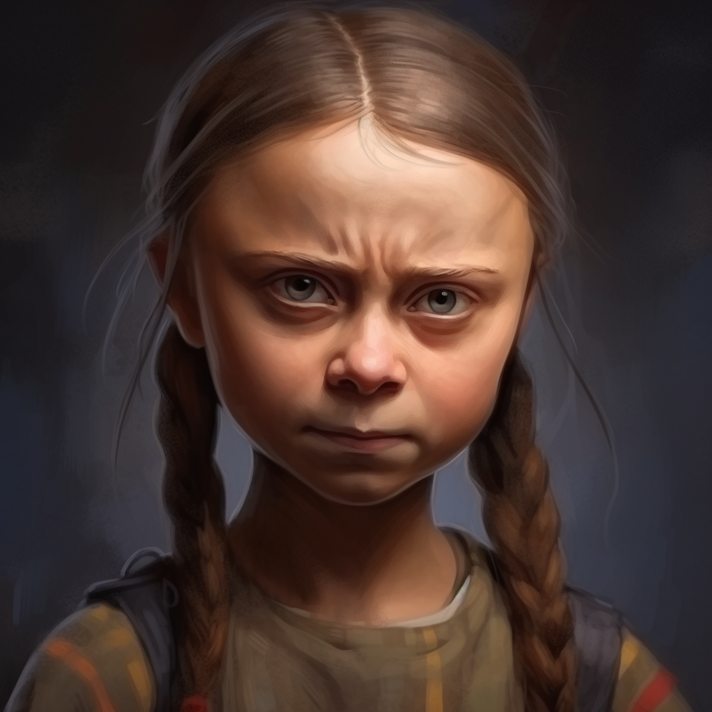
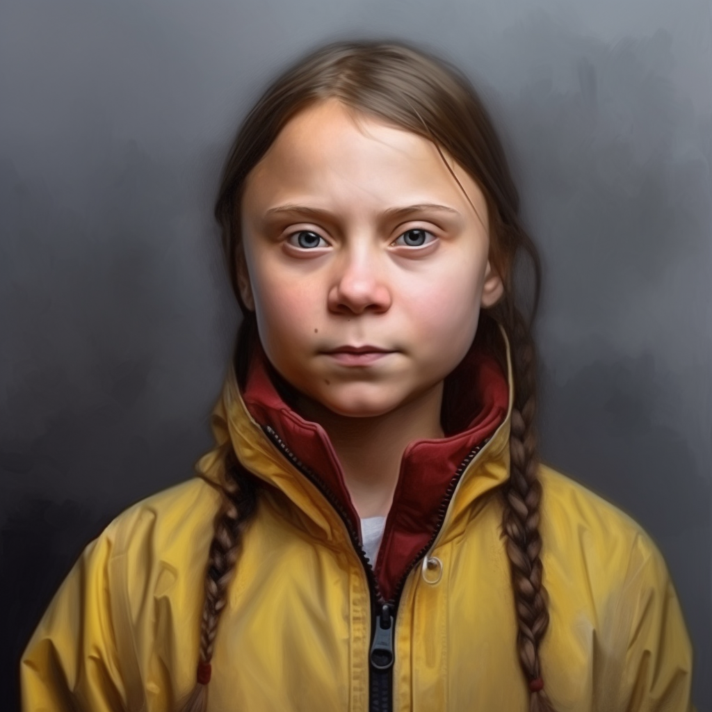
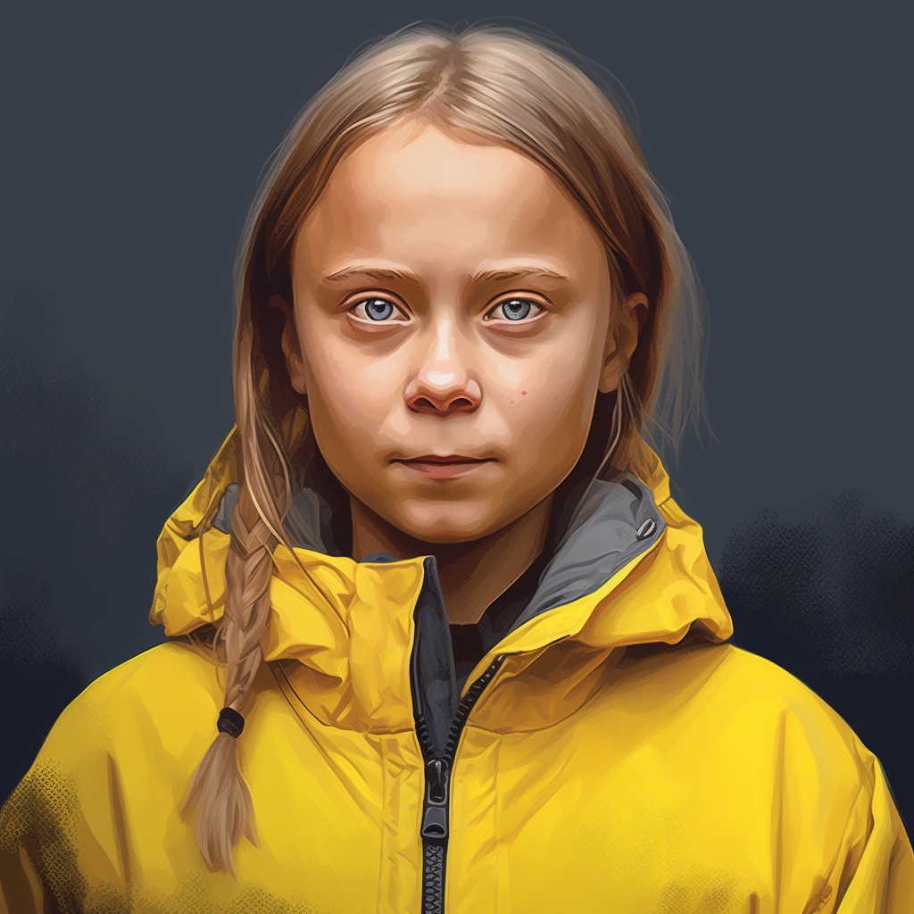
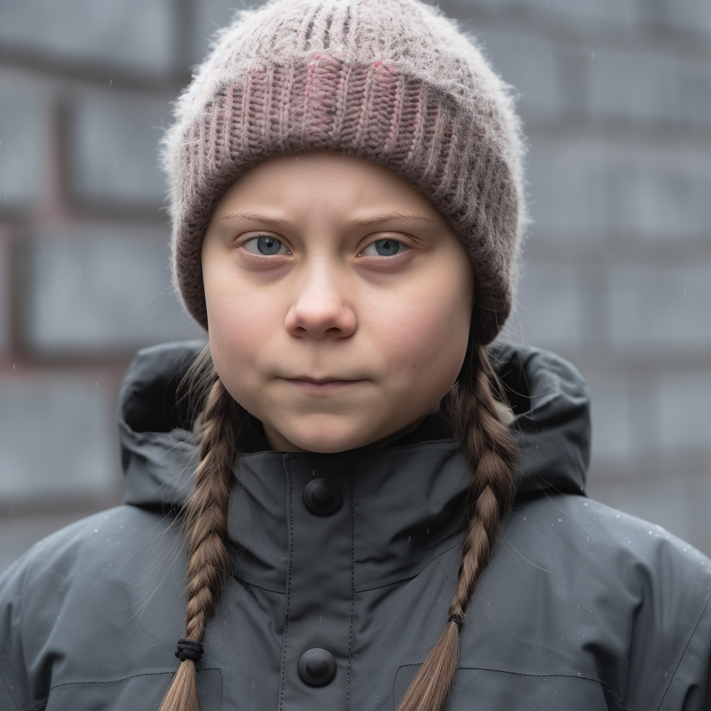

#

  [audio](media/1a.mp3) 

https://github.com/c1earcase/tranq/assets/8038214/f5b093e7-1a45-49fd-87c5-ac0d385bb1a5

https://github.com/OpenTalker/SadTalker

```
python inference.py --driven_audio audio_Vocals.wav --source_image midjourney.jpg
```

  |  
<br/>
  |  

Compare all 4 Generations: https://youtube.com/shorts/Wz1Uv7fSVjw

---
Optional, separate vocals and instrumentals from "song":

https://github.com/tsurumeso/vocal-remover

```
python inference.py --input path/to/an/audio.wav
```

will produce <b>audio_Vocals.wav</b> and audio_Instrumentals.wav

