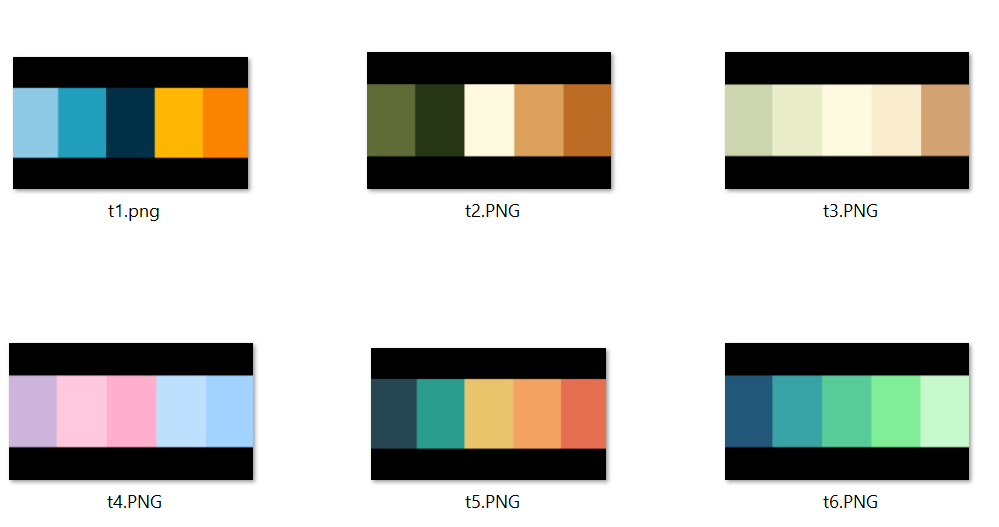
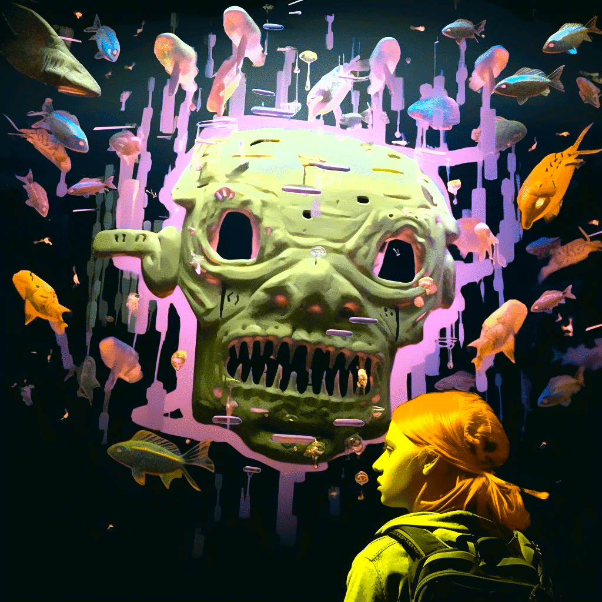

# variations_on_a_theme

-------------
Here is a piece of NFT art that shows up on my Twitter Feed that can be found by searching "xcopy max pain".


How can I make variations on such a theme? 

You can modify an original image in Midjourney using image prompts:

https://docs.midjourney.com/docs/image-prompts


Here are some ideas for variations:

https://mpost.io/midjourney-and-dall-e-artist-styles-dump-with-examples-130-famous-ai-painting-techniques/

Suddenly,

/imagine https://media.discordapp.net/attachments/xxx/yyy/abc.png Anaglyph Filter, Ivan Aivazovsky

/imagine https://media.discordapp.net/attachments/xxx/yyy/abc.png Blueprint, Yoshitaka Amano

...

This above is obviously the "creative" part where you experiment with prompts until you get an image you like.


Save this as [source/s1.png](source/s1.png). Now, I'd like to create an animated gif, sequencing over 6 images. I found "Color Transfer between Images". It takes a source image, "applies a color profile", and gives a resultant image.

https://github.com/chia56028/Color-Transfer-between-Images


Now, I need 6 color profiles to apply. Let's just use a palette website.

https://coolors.co/palettes/trending


I took a "snapshot" of each of the profiles above and saved as a local image. I then converted these images to a standard resolution with a black background. This particular step is not neccessary, I just wanted black to be the dominant color in the profile.

```
mkdir landscape
for fullfile in *.PNG; do
  filename=$(basename -- "$fullfile"); extension="${filename##*.}"; f="${filename%.*}"
  convert ${fullfile} -resize 1920x1080 -gravity center -background "rgb(0,0,0)" -extent 1920x1080 landscape/${fullfile}
done
```

I then placed these images into the [target](target) folder.



Run the code...


Convert to an animaged gif.

```
cd result
mkdir -p gifs
rand_num=$(( ( RANDOM % 100 )  + 1 ))
convert -delay 5 -loop 0 *.png gifs/final_${rand_num}.gif
cd ..
```


